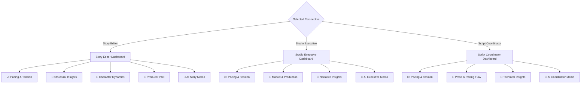

# ScriptPulse: Web Dashboard & System Architecture

This document provides a technical overview of the **ScriptPulse Web Application**, its user interface structure, styling system, components, views, data flow, and interactive charting modules.

---

## 🗺️ Web App Architecture & Layout

The ScriptPulse website is built as an interactive dashboard using the **Streamlit** framework in Python. The dashboard acts as a user interface for the underlying 7-agent story intelligence pipeline.

### Entrypoint & Startup Flow
1. **Proxy Redirect:** `streamlit_app.py` at the project root acts as a proxy that loads and executes `app/streamlit_app.py` dynamically to satisfy Streamlit Cloud hosting requirements.
2. **Page Configuration:** Sets page title to `"ScriptPulse — AI Story Intelligence"`, configures custom brand icon, and sets the layout to `"wide"`.
3. **Design System & Styles Initialization:** Applies custom HSL-based vanilla CSS styles (`app/components/styles.py`) and initializes responsive Plotly chart templates (`app/components/theme.py`).

---

## 🎨 Design System & Aesthetics (Vanilla CSS)

The visual design system of ScriptPulse is built directly on top of Streamlit using a custom-tailored CSS injection file: [styles.py](file:///Users/shameekyogi/My%20Apps/ScriptPulse%20Project/app/components/styles.py) and registered theme registry in [theme.py](file:///Users/shameekyogi/My%20Apps/ScriptPulse%20Project/app/components/theme.py). It establishes a premium, state-of-the-art cinematic aesthetic.

### 🎨 Color Palette Specifications
ScriptPulse uses a highly curated, dark-mode-first color palette designed to give the application a premium "instrument" look. 

| Palette Category | Variable Name | Hex Code | Visual & Semantic Role |
| :--- | :--- | :--- | :--- |
| **Core Backgrounds** | `Theme.BG_PRIMARY` | `#1A1729` | Deep obsidian backdrop of the entire viewport. |
| | `Theme.BG_SECONDARY` | `#221E34` | Slightly lighter purple-tinted obsidian for sidebars and popovers. |
| | `Theme.BG_CARD` | `rgba(32, 29, 48, 0.65)` | Translucent dark purple-gray backing for cards (applies backdrop-filter). |
| | `Theme.BG_CARD_HOVER` | `rgba(40, 36, 60, 0.8)` | Lifted highlight card color when hovered. |
| **Text Colors** | `Theme.TEXT_PRIMARY` | `#F4F6FB` | Crisp, high-contrast off-white for titles and primary body text. |
| | `Theme.TEXT_SECONDARY` | `#A3A0B3` | Lavender-gray for subtitles, descriptors, and secondary metrics. |
| | `Theme.TEXT_MUTED` | `rgba(244, 246, 251, 0.45)` | Dimmed gray for caption text, notes, and disclaimers. |
| **Accents & Brand** | `Theme.ACCENT_PRIMARY` | `#6A48BB` | Neon royal purple used as the main branding, primary buttons, and tabs. |
| | `Theme.ACCENT_SECONDARY`| `#2F48B9` | Cobalt blue for deep links and technical panels. |
| | `Theme.ACCENT_WARM` | `#F57946` | Vivid amber-orange for dynamic, energetic action peaks. |
| | `Theme.ACCENT_TEAL` | `#00D2A0` | Electric mint green for positive highlights and healthy pacing indicators. |
| | `Theme.ACCENT_ROSE` | `#D92987` | Crimson hot pink for critical metrics and dramatic cliffhangers. |
| | `Theme.ACCENT_BLUE` | `#8EC5E9` | Soft ice blue for analytical and informational callouts. |
| | `Theme.ACCENT_PURPLE` | `#A74EC6` | Bright violet for secondary brand highlights. |
| **Semantic States** | `Theme.SEMANTIC_GOOD` | `#00D2A0` | Mint green indicating stable, well-paced, or highly-economical scenes. |
| | `Theme.SEMANTIC_WARNING`| `#F57946` | Amber orange indicating rising fatigue or moderate tension demand. |
| | `Theme.SEMANTIC_CRITICAL`| `#D92987` | Rose-crimson signifying attention fatigue risk or bloated scenes. |
| | `Theme.SEMANTIC_INFO` | `#8EC5E9` | Soft ice blue for technical feedback and AI-generated memos. |

### 🌈 Visual Gradients
* **Hero Gradient (`--gradient-hero`):** A three-stop linear gradient (`linear-gradient(135deg, #6A48BB 0%, #A74EC6 50%, #D92987 100%)`) mapping neon purple, bright violet, and rose-crimson. Used as the highlight border-line for metrics and button backgrounds.
* **Subtle Gradient (`--gradient-subtle`):** A soft, low-opacity backing gradient (`linear-gradient(135deg, rgba(106, 72, 187, 0.08) 0%, rgba(217, 41, 135, 0.05) 100%)`) for sub-sections.
* **Brand Pulse Gradient (`.brand-pulse-gradient`):** A cyan-to-blue linear gradient (`linear-gradient(135deg, #55E0FF 0%, #0052FF 100%)`) with a high-glow drop shadow (`0 0 20px rgba(85, 224, 255, 0.35)`) used on logo typography.

### ✨ Visual Styling & Interactions
* **Glassmorphism:** Leverages `backdrop-filter: blur(12px)` and thin semi-transparent borders (`border: 1px solid rgba(255,255,255,0.05)`) on card panels and inputs.
* **Metric Card Hover:** Interactive CSS transform rules scale metric cards up by `1.02` and translate them `translateY(-6px)` on hover, with a box shadow glow: `0 16px 32px rgba(0, 0, 0, 0.5), 0 0 20px rgba(106, 72, 187, 0.35)`.
* **Pulse Animations:** Semantic alert boxes contain looping pulsing glows (e.g., critical cards glow with `pulse-rose`: `box-shadow: -4px 0 15px rgba(255, 51, 102, 0.15)` pulsing to `30px` opacity).
* **Typography:** Integrates modern sans-serif typography via Google Fonts: `Outfit` (for titles and numbers) and `Inter` (for readable, clean body text), with `JetBrains Mono` for screenplay text blocks.

---

## 🛠️ User Workflow & Interactive Panels

The user experience is split into two phases: **Setup** (Double-Column Layout) and **Results** (Persona-Responsive Views).

```
+-----------------------------------------------------------------------+
|                              HERO BANNER                              |
|           "AI Story Intelligence — Attentional Flow Diagnostics"       |
+-----------------------------------+-----------------------------------+
|         LEFT: SCRIPT INPUT        |         RIGHT: CONFIGURATION      |
|  - File Uploader (PDF, TXT, FDX)  |  - Genre Selection Selectbox      |
|  - Paste Area + Word Counter      |  - Perspective (Lens) Selectbox   |
|                                   |  - Limits & System Methodology    |
+-----------------------------------+-----------------------------------+
|                     🎬 "Analyze My Script" Button                     |
+-----------------------------------------------------------------------+
```

### 1. The Setup Interface
* **Left Column — Screenplay Ingest:**
  * **File Uploader:** Accepts PDF, TXT, and Final Draft XML (`.fdx`) files.
  * **PDF Extractor:** Parses text pages using `PyPDF2`, checking word count to identify scanned (image-only) PDFs.
  * **FDX Importer:** Integrates `ImporterAgent` to parse XML nodes securely and extract pure dialogue, actions, and headings.
  * **Paste Area:** Text box for quick testing with an interactive live word counter.
* **Right Column — Analysis Parameters:**
  * **Genre Calibrator:** Adjusts mathematical pacing baselines ($\lambda$ decay and $\beta$ recovery rates) to match standard genre envelopes (*Drama, Action, Thriller, Horror, Comedy, Sci-Fi, Romance, Fantasy, Avant-Garde*).
  * **Perspective Selector:** Switches the dashboard presentation to match a specific industry lens (*Story Editor, Studio Executive, Script Coordinator*).

### 2. High-Fidelity Loading Screen
When the analysis is triggered, the app displays a custom CSS-animated loading modal showing real-time pipeline status:
* **Stages tracked:** Structure Parsing (0-25%), Feature Extraction (45%), Cognitive Simulation (55%), Narrative Interpretation (65%), and Writer Insights Assembly (100%).
* **Visuals:** Features a neon-pulsing circular loader and a sliding gradient progress bar.

---

## 👥 Persona-Responsive Views

Once the analysis runs, the dashboard organizes metrics and displays tabs custom-tailored to the selected perspective. Each view contains an **AI Memo** tab that generates a contextual coverage report by querying API backends.



### A. Story Editor (Structural Focus)
* **Goal:** Review overall pacing, character transformations, and narrative milestones.
* **Score Card Metrics:** Page-Turner Index, Pacing Classification, Midpoint Status, Total Scenes, and Runtime Context.
* **Featured Components:**
  * **Mentor's Corner:** Injects creative provocations challenging specific pacing anomalies.
  * **Character Dynamics:** Displays comparative progress bars tracking characters' structural agency and emotional shifts.
  * **Scene Turns Table:** Identifies specific scenes where the emotional charge flips (e.g., *Positive to Negative*, *Negative Progression*).

### B. Studio Executive (Production Focus)
* **Goal:** Assess budget impacts, location constraints, and commercial viability.
* **Score Card Metrics:** Market Readiness Signal (0-100), Production Complexity Score, Budget Tier (Indie, Studio, Blockbuster), Total Location Count, Cast Size, and Estimated Runtime.
* **Featured Components:**
  * **Location Profile Indicator:** Flags if there are too many unique sets or highlights primary sets (e.g., *"Scene count: 15. Set: CORLEONE OFFICE (25% of scenes)"*).
  * **Market Comps Card:** Suggests comparable commercial movies matching the genre and stakes profiles.

### C. Script Coordinator (Technical Craft Focus)
* **Goal:** Audit prose density, sentence structures, and technical dialogue elements.
* **Score Card Metrics:** Writing Texture (Cinematic vs Novelistic), Pacing, Page-Turner momentum, Scene count, and Runtime.
* **Featured Components:**
  * **Scene Economy Panel:** Splits scenes into **Trim Candidates** (bloated scenes with low information density) and **Lean Gems** (highly compressed scenes) using comparative progress bars.
  * **Technical Insight Cards:** Surfaces detailed warnings like *Same Voice Syndrome*, *Shoe-Leather filler dialogue*, or *Exposition Heavy* sequences.

---

## 📈 Interactive Charting & Data Visualizations

ScriptPulse maps narrative dynamics visually using Plotly layouts (`app/components/charts.py`):

1. **Attentional Flow Map (Narrative Tension):**
   * Plots $S_t$ (Attentional Signal) against the sequence of scenes.
   * Renders color-coded areas: **Peak Intensity** (red gradient), **Steady Progression** (blue), and **Breather/Drift** (yellow).
   * Automatically annotates structural turning points (Inciting Incident, Act 1 Break, Midpoint, Act 2 Break) using vertical dotted lines.
   * Includes interactive hover tooltips with custom metadata.
2. **Stakes Distribution Donut Chart:**
   * A Plotly pie chart showing normalized proportions of Social, Physical, Moral, Existential, and Emotional stakes present in the screenplay.
3. **Narrative Efficiency Frontier:**
   * A scatter plot comparing scene-by-scene cognitive effort against pacing shifts to analyze the script's thematic complexity.

---

## 📤 Export Formats & Reports

ScriptPulse includes download handlers to export analysis results:
* **Writer Report (`.md`):** A markdown file summarizing narrative health, diagnostics, and priorities.
* **Studio Coverage (`.html`):** A premium HTML memo styled as a coverage brief, suitable for sharing with agents and executives.
* **One-Page Summary (`.html`):** A printable, compact overview of the script's pacing curves and character profiles.
* **Full JSON Trace (`.json`):** Exports the raw, step-by-step diagnostic trace data for researchers or developers.
