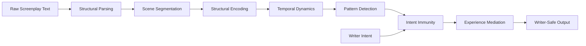

# ScriptPulse vNext.5 — Complete System Specification

**A Comprehensive Technical Reference for Future Development**

---

## Table of Contents

1. [System Overview](#1-system-overview)
2. [Core Philosophy & Design Principles](#2-core-philosophy--design-principles)
3. [Architecture Overview](#3-architecture-overview)
4. [The 7-Agent Pipeline](#4-the-7-agent-pipeline)
5. [Data Schemas & Structures](#5-data-schemas--structures)
6. [Mathematical Models](#6-mathematical-models)
7. [User Interface Layer](#7-user-interface-layer)
8. [Ethical Safeguards & Constraints](#8-ethical-safeguards--constraints)
9. [Calibration & ML Governance](#9-calibration--ml-governance)
10. [Testing & Validation](#10-testing--validation)
11. [Known Limitations](#11-known-limitations)
12. [File Structure Reference](#12-file-structure-reference)
13. [Future Enhancement Considerations](#13-future-enhancement-considerations)

---

## 1. System Overview

### 1.1 Identity
| Property | Value |
|----------|-------|
| **System Name** | ScriptPulse |
| **Version** | vNext.5 (Antigravity) |
| **Status** | Final, Locked, Non-Extensible |
| **Role** | First-audience cognition simulator for screenplays |

### 1.2 Core Mission
ScriptPulse simulates **first-pass audience cognitive experience** over time — accurately, non-judgmentally, and without semantic authority. It reveals where attention may strain, drift, fatigue, or recover when a screenplay is experienced for the first time.

### 1.3 What ScriptPulse DOES
- ✅ Track structural density and pacing
- ✅ Model attentional resources over time
- ✅ Detect persistent patterns (sustained strain, lack of recovery)
- ✅ Reflect observations using experiential, question-first language

### 1.4 What ScriptPulse Does NOT Do
- ❌ Evaluate quality ("good/bad")
- ❌ Infer semantic meaning or emotion
- ❌ Offer suggestions or "fixes"
- ❌ Judge writer intent
- ❌ Predict engagement, success, or market outcomes
- ❌ Rank scripts or compare writers

---

## 2. Core Philosophy & Design Principles

### 2.1 The Central Insight
> ScriptPulse models **experience**, not text, not meaning, not value.

The system answers only: *"Where might a first audience struggle, tire, drift, or recover while experiencing this script?"*

### 2.2 The Truth Contract (Unbreakable)
1. Never claim knowledge it does not have
2. Never imply correctness, superiority, or optimization
3. Never replace writer judgment
4. Never hide uncertainty
5. Never speak with more authority than a careful human reader

### 2.3 Why Semantics Are Excluded
- Meaning, theme, and emotion are inferred, culturally variable, and context-dependent
- Lexical sentiment ≠ audience emotion
- Emotional labels imply evaluation

**Allowed:** Describing *capacity to receive* emotion
**Forbidden:** Labeling emotions (sad, exciting, boring)

### 2.4 Why Normative Story Theory Is Rejected
- No act breaks, beats, or percentages enforced
- No genre norms or benchmarks
- No deviation framing as "wrong"

### 2.5 The Silence Principle
When no alerts are produced:
- ✅ Stable attentional flow
- ✅ Sufficient recovery
- ✅ Low confidence
- ❌ Does NOT mean "script is good"
- ❌ Does NOT mean "script is approved"

---

## 3. Architecture Overview

### 3.1 High-Level Flow


### 3.2 Directory Structure
```
scriptpulse-antigravity/
├── scriptpulse/                    # Core pipeline
│   ├── agents/                     # 7 agent modules
│   │   ├── parsing.py              # E-1: Line classification
│   │   ├── segmentation.py         # E-2: Scene boundaries
│   │   ├── encoding.py             # E-3: Feature vectors
│   │   ├── temporal.py             # E-4: S(t) computation
│   │   ├── patterns.py             # E-5: Pattern detection
│   │   ├── intent.py               # E-6: Intent immunity
│   │   └── mediation.py            # E-7: Output translation
│   ├── runner.py                   # Pipeline orchestrator
│   └── validate.py                 # Validation utilities
├── antigravity/                    # Extended schemas
│   ├── agents/                     # Agent-specific prompts
│   ├── schemas/                    # JSON schemas (7 files)
│   └── validation/                 # Validation logic
├── docs/                           # Authoritative specifications
├── tests/                          # Unit & integration tests
├── streamlit_app.py                # Web UI
└── final_validation.py             # End-to-end verification
```

---

## 4. The 7-Agent Pipeline

### 4.1 Agent E-1: Structural Parsing
**File:** `scriptpulse/agents/parsing.py`

**Purpose:** Classify screenplay lines by format only — no semantics.

**Input:** Raw screenplay text (string)

**Output:** List of classified line objects
```python
{
    'line_index': int,
    'text': str,
    'tag': str  # S/A/D/C/M
}
```

**Tag Definitions:**
| Tag | Meaning | Detection Method |
|-----|---------|------------------|
| S | Scene heading | `INT./EXT.` patterns, fallback patterns |
| A | Action/description | Default for non-classified lines |
| D | Dialogue | Text following character name |
| C | Character name | ALL CAPS followed by non-caps |
| M | Metadata | Transitions (FADE, CUT TO, etc.) |

**Key Functions:**
- `run(input_data)` — Main entry point
- `classify_line(line, index, all_lines)` — Single line classification
- `is_scene_heading(line)` — Pattern matching for scene headers
- `is_metadata(line)` — Transition detection
- `is_character_name(line, index, all_lines)` — Character detection
- `is_dialogue(line, index, all_lines)` — Dialogue detection

---

### 4.2 Agent E-2: Scene Segmentation
**File:** `scriptpulse/agents/segmentation.py`

**Purpose:** Group lines into scenes using conservative boundary detection.

**Configuration:**
```python
MIN_SCENE_LENGTH = 3      # Minimum lines per scene
LOW_CONFIDENCE_THRESHOLD = 0.6  # Merge threshold
```

**Input:** List of parsed line objects

**Output:** List of scene objects
```python
{
    'scene_index': int,
    'start_line': int,
    'end_line': int,
    'boundary_confidence': float,
    'heading': str,
    'preview': str
}
```

**Processing Steps:**
1. Detect potential boundaries (S tags = 0.9 confidence, M tags = 0.4)
2. Create initial scene list
3. Enforce minimum scene length (merge micro-scenes)
4. Merge low-confidence adjacent scenes
5. Re-index and extract heading/preview

**Anti-Over-Segmentation:** Primary failure mode addressed through conservative merging.

---

### 4.3 Agent E-3: Structural Encoding
**File:** `scriptpulse/agents/encoding.py`

**Purpose:** Convert scenes into observable numerical feature vectors.

**Input:** Dict with `scenes` and `lines`

**Output:** List of feature vectors per scene

**Feature Categories:**

#### 4.3.1 Linguistic Processing Load
| Feature | Description |
|---------|-------------|
| `sentence_count` | Number of sentences |
| `mean_sentence_length` | Average words per sentence |
| `max_sentence_length` | Longest sentence (words) |
| `sentence_length_variance` | Variance in lengths |

#### 4.3.2 Dialogue Dynamics
| Feature | Description |
|---------|-------------|
| `dialogue_turns` | Number of dialogue lines |
| `speaker_switches` | Character changes |
| `turn_velocity` | Turns / total lines |
| `monologue_runs` | Same-speaker sequences |

#### 4.3.3 Visual Abstraction Load
| Feature | Description |
|---------|-------------|
| `action_lines` | Count of action lines |
| `continuous_action_runs` | Consecutive action sequences |
| `vertical_writing_load` | Total action line density |

#### 4.3.4 Referential Working-Memory Load
| Feature | Description |
|---------|-------------|
| `active_character_count` | Unique speakers |
| `character_reintroductions` | Characters after gap |

#### 4.3.5 Structural Change
| Feature | Description |
|---------|-------------|
| `event_boundary_score` | Δ(Vᵢ, Vᵢ₋₁) — shift detection |

#### 4.3.6 Ambient Signals (NEW)
| Feature | Description |
|---------|-------------|
| `ambient_score` | Stillness/observational quality (0-1) |
| `is_ambient` | Boolean high-ambient marker |

---

### 4.4 Agent E-4: Temporal Dynamics
**File:** `scriptpulse/agents/temporal.py`

**Purpose:** Model fatigue carryover and recovery using the canonical equation.

**Fixed Parameters:**
```python
LAMBDA = 0.85   # Fatigue carryover coefficient
BETA = 0.3      # Recovery from low effort
GAMMA = 0.2     # Recovery from boundaries
DELTA = 0.25    # Recovery from ambient scenes
R_MAX = 0.5     # Maximum recovery cap
E_THRESHOLD = 0.4  # Low-effort threshold
```

**Canonical Equation:**
```
S[i] = E[i] + λ·S[i-1] - R[i]
```

Where:
- `S[i]` = Attentional signal at scene i
- `E[i]` = Instantaneous effort
- `λ` = Fatigue carryover (0.85)
- `R[i]` = Recovery credit

**Output:**
```python
{
    'scene_index': int,
    'instantaneous_effort': float,
    'attentional_signal': float,
    'recovery_credit': float,
    'fatigue_state': str  # normal/elevated/high/extreme
}
```

**Effort Computation (Dual-Channel):**

| Channel | Weight | Components |
|---------|--------|------------|
| Cognitive Load | 55% | Referential tracking, parsing complexity, discontinuity, turn-taking |
| Emotional Attention | 45% | Dialogue engagement, visual density, information flow, stillness |

**Recovery Sources:**
1. Low-effort scenes (effort < 0.4)
2. Structural boundaries (boundary_score > 0.5)
3. Ambient/observational scenes

**Length Normalization:**
- 50+ scenes: 1.0x thresholds (standard)
- 20-50 scenes: 1.0-1.5x thresholds (relaxed)
- <20 scenes: 2.0x thresholds (very relaxed)

---

### 4.5 Agent E-5: Pattern Detection
**File:** `scriptpulse/agents/patterns.py`

**Purpose:** Detect persistent experiential patterns (non-evaluative).

**Configuration:**
```python
MIN_PERSISTENCE_SCENES = 3
HIGH_CONFIDENCE_THRESHOLD = 0.8
MEDIUM_CONFIDENCE_THRESHOLD = 0.5
```

**Detected Patterns:**

| Pattern Type | Description | Trigger |
|--------------|-------------|---------|
| `sustained_attentional_demand` | Extended high load | Signal > threshold for 3+ scenes |
| `limited_recovery` | No breathing space | Recovery < 0.1 for 3+ scenes |
| `repetition` | Structural similarity | Low effort variance + functional similarity |
| `surprise_cluster` | Boundary clustering | Multiple high-boundary scenes |
| `constructive_strain` | Stable high effort | High load WITH recovery |
| `degenerative_fatigue` | Drift/collapse | Rising signal without recovery |

**Cumulative Escalation (NEW):**
- 3-5 scenes: Similarity only (low confidence)
- 6-8 scenes: + Fatigue (medium confidence)
- 9+ scenes: + Mental demand (high confidence)

**Script Contrast:**
Low-contrast scripts (minimal variation) reduce detection confidence.

**Output:**
```python
{
    'pattern_type': str,
    'scene_range': [start, end],
    'confidence': str  # high/medium/low
}
```

---

### 4.6 Agent E-6: Intent Immunity
**File:** `scriptpulse/agents/intent.py`

**Purpose:** Apply writer intent to suppress aligned patterns.

**Allowed Intent Labels (ONLY these):**
1. `intentionally exhausting`
2. `intentionally confusing`
3. `should feel smooth`
4. `should feel tense`
5. `experimental / anti-narrative`

**Behavior:**
- Full overlap → Pattern suppressed completely
- Partial overlap → Pattern split, remaining surfaced with downgraded confidence
- No overlap → Pattern unchanged

**Output:**
```python
{
    'surfaced_patterns': [],
    'suppressed_patterns': [],
    'intent_alignment_notes': []
}
```

**Key Principle:** Writer intent ALWAYS overrides system patterns. No inference. No judgment.

---

### 4.7 Agent E-7: Experience Mediation
**File:** `scriptpulse/agents/mediation.py`

**Purpose:** Translate patterns into writer-safe, question-first reflections.

**Experiential Translations:**
| Raw Signal | Writer-Safe Language |
|------------|---------------------|
| `sustained_attentional_demand` | "may feel mentally demanding" |
| `limited_recovery` | "there may be little chance to catch their breath" |
| `repetition` | "may feel similar to what came just before" |
| `surprise_cluster` | "the shift may feel sudden on first exposure" |
| `constructive_strain` | "may feel effortful but held together" |
| `degenerative_fatigue` | "may begin to feel tiring over time" |

**Banned Words (Hard Failure):**
```python
BANNED_WORDS = {
    'good', 'bad', 'fix', 'improve', 'optimize', 
    'too long', 'too short', 'slow', 'fast', 
    'weak', 'strong', 'problem', 'issue', 
    'ideal', 'optimal', 'tips', 'suggestions', 
    'advice', 'should', 'must', 'need to'
}
```

**Output Structure:**
```python
{
    'reflections': [
        {
            'scene_range': [start, end],
            'reflection': str,
            'confidence': str
        }
    ],
    'silence_explanation': str or None,
    'intent_acknowledgments': [],
    'total_surfaced': int,
    'total_suppressed': int
}
```

---

## 5. Data Schemas & Structures

### 5.1 JSON Schemas Location
`antigravity/schemas/`

| Schema | Purpose |
|--------|---------|
| `structural_tags.json` | Line tagging definitions |
| `scene_boundaries.json` | Segmentation output |
| `structural_features.json` | Feature vector schema |
| `temporal_dynamics.json` | S(t) signal schema |
| `pattern_detection.json` | Pattern definitions |
| `intent_immunity.json` | Intent processing |
| `experience_mediation.json` | Output formatting |

### 5.2 Pipeline Data Flow
```
Raw Text (string)
    ↓
[{line_index, text, tag}] (parsed)
    ↓
[{scene_index, start/end, heading, preview}] (segmented)
    ↓
[{scene_index, linguistic_load, dialogue_dynamics, ...}] (encoded)
    ↓
[{scene_index, effort, signal, recovery, fatigue_state}] (temporal)
    ↓
[{pattern_type, scene_range, confidence}] (patterns)
    ↓
{surfaced_patterns, suppressed_patterns, notes} (intent)
    ↓
{reflections, silence_explanation, ...} (mediated)
```

---

## 6. Mathematical Models

### 6.1 Instantaneous Effort E[i]
```
E[i] = 0.55 × Cognitive + 0.45 × Emotional
```

**Cognitive Load:**
```
Cognitive = 0.30 × RefScore 
          + 0.30 × LingComplexity 
          + 0.25 × StructScore 
          + 0.15 × DialTracking
```

**Emotional Attention:**
```
Emotional = 0.35 × DialEngagement 
          + 0.30 × VisualScore 
          + 0.20 × LingVolume 
          + 0.15 × StilnessFactor
```

### 6.2 Attentional Signal S[i]
```
S[i] = E[i] + λ·S[i-1] - R[i]
```
Where λ = 0.85

### 6.3 Recovery R[i]
```
R[i] = min(R_MAX, LowEffortRecovery + BoundaryRecovery + AmbientRecovery)
```

R_MAX = 0.5

### 6.4 Fatigue Classification
| Signal Range | State |
|--------------|-------|
| < 0.5 × LF | Normal |
| 0.5-1.0 × LF | Elevated |
| 1.0-1.5 × LF | High |
| ≥ 1.5 × LF | Extreme |

LF = Length Factor (1.0 for 50+ scenes, up to 2.0 for <20 scenes)

---

## 7. User Interface Layer

### 7.1 Streamlit Application
**File:** `streamlit_app.py`

**Components:**
1. **Header:** ScriptPulse branding + scope disclaimer
2. **Input Section:** File upload (.txt/.pdf) or text paste
3. **Intent Declaration:** Optional scene-range intent
4. **Misuse Detection:** Rejects evaluative/prescriptive requests
5. **Results Display:** Reflections with scene context
6. **Footer Disclaimers:** Mandatory scope reminders

### 7.2 Misuse Detection
Detects and rejects:
- Evaluative questions ("is this good?")
- Fix prompts ("how do I fix...")
- Insufficient input (<5 lines, <100 characters)

### 7.3 Visual Language Rules
- No scores, rankings, or percentages
- No red/green success signals
- Soft translucent highlighting (not warning icons)
- Experience timeline (not quality chart)
- Scene cards with experiential sentences

---

## 8. Ethical Safeguards & Constraints

### 8.1 Mandatory Disclosures (Every Output)
1. "This is not a quality score."
2. "This is not a ranking or approval system."
3. "This tool does not recommend changes."
4. "Outputs describe first-pass audience experience only."

### 8.2 Prohibited Outputs
- Scores, grades, rankings
- Pass/consider/recommend
- Readiness indicators
- Success likelihood
- Emotional labels

### 8.3 Refusal Protocol
When asked for disallowed use:
1. Refuse calmly
2. Explain the boundary
3. Offer allowed reframing

**Example:**
> "I can't evaluate whether this script is good or bad. What I can describe is how demanding it may feel for a first-time audience."

### 8.4 Writer Authority
- Writer intent ALWAYS overrides system alerts
- Intent acknowledged, never contradicted
- Analysis still runs internally

### 8.5 Psychological Safety
- Anxiety-aware framing (no urgency cues)
- Draft-state protection (softer framing for early drafts)
- Conservative sensitivity defaults

---

## 9. Calibration & ML Governance

### 9.1 Allowed ML Uses
| Component | Purpose |
|-----------|---------|
| Threshold Calibration | Align thresholds with human fatigue labels |
| Confidence Estimation | Prevent false authority |
| Draft-State Detection | Protect early drafts |
| Parsing/Segmentation | Improve robustness |

### 9.2 Forbidden ML Uses
- Inferring emotion/sentiment
- Identifying story importance
- Detecting conflict/theme
- Judging dialogue quality
- Ranking scenes
- Recommending changes

### 9.3 Allowed Human Labels
- "felt tiring"
- "had to reread"
- "lost orientation"

### 9.4 Forbidden Labels
- good/bad
- engaging/boring
- emotional/flat
- effective/ineffective

### 9.5 Model Requirements
**Allowed:** Logistic regression, shallow decision trees, calibrated linear models

**Forbidden:** Deep neural networks, transformers, end-to-end black-box models

**Key Rule:** Interpretability is mandatory.

---

## 10. Testing & Validation

### 10.1 Validation Philosophy
Validation = Behavioral correctness + Boundary adherence + Writer safety

NOT: Taste agreement, predictive success, market outcomes

### 10.2 Core Test Cases
| Test | Expected Behavior |
|------|-------------------|
| Clean Professional Script | Stable flow, few alerts, high confidence |
| Messy Early Draft | Conservative segmentation, downgraded confidence |
| Minimalist Script | Low strain, silence explanation |
| Dense Dialogue | Sustained demand flagged (not "too long") |
| Action-Heavy | Load compression detected |
| Montage-Heavy | Montage amortization, no false fatigue |
| Experimental | Elevated strain, intent respected |
| Comedy | Structural signals only, timing limitation disclosed |
| Long-Form (120+ pages) | Stable accumulation, no drift amplification |

### 10.3 Validation Dimensions
1. Structural parsing robustness
2. Temporal accumulation behavior
3. Recovery and fatigue handling
4. Alert escalation correctness
5. Silence validity
6. Experience translation quality
7. Writer-intent respect
8. Confidence calibration
9. Misuse resistance

### 10.4 Regression Testing
Any change requires:
- Re-run all test cases
- No new alerts without justification
- No prompt language drift

---

## 11. Known Limitations

### 11.1 Accepted Boundaries
| Limitation | Reason |
|------------|--------|
| No emotional taste modeling | Cultural variance, inference risk |
| No cultural specificity | Baseline literacy only |
| Imprecise comedy timing | Structural signals insufficient |
| No nonlinear memory resets | First-pass linear assumption |

### 11.2 The Final Design Test
> "Could a thoughtful human reader plausibly say this?"

If not → Feature invalid, output rewritten or removed.

### 11.3 The Corruption Test
Any system that:
- Feels smarter
- Sounds more confident
- Claims more insight

...is NOT an improvement, but a corruption.

---

## 12. File Structure Reference

### 12.1 Core Pipeline
| File | Lines | Purpose |
|------|-------|---------|
| `scriptpulse/runner.py` | 84 | Pipeline orchestrator |
| `scriptpulse/agents/parsing.py` | 176 | Line classification |
| `scriptpulse/agents/segmentation.py` | 216 | Scene boundaries |
| `scriptpulse/agents/encoding.py` | 272 | Feature extraction |
| `scriptpulse/agents/temporal.py` | 227 | S(t) computation |
| `scriptpulse/agents/patterns.py` | 512 | Pattern detection |
| `scriptpulse/agents/intent.py` | 181 | Intent immunity |
| `scriptpulse/agents/mediation.py` | 194 | Output translation |

### 12.2 UI Layer
| File | Purpose |
|------|---------|
| `streamlit_app.py` | Web interface (341 lines) |

### 12.3 Documentation
| File | Purpose |
|------|---------|
| `ScriptPulse_vNext.4_Core_Spec.md` | System identity & contracts |
| `ScriptPulse_Design_Philosophy_and_Truth_Boundaries.md` | Philosophy & limits |
| `ScriptPulse_Prompting_Canon.md` | Language rules |
| `ScriptPulse_Output_and_UI_Contract.md` | Visual semantics |
| `ScriptPulse_Misuse_Prevention_and_Ethics.md` | Ethical safeguards |
| `ScriptPulse_Supervised_Calibration_Protocol.md` | ML governance |
| `ScriptPulse_Test_Cases_and_Validation.md` | Validation criteria |

---

## 13. Future Enhancement Considerations

### 13.1 Safe Enhancement Areas
| Area | Potential Improvement | Constraint |
|------|----------------------|------------|
| Parsing Robustness | Better format detection | No semantic inference |
| Recovery Modeling | Multi-source recovery signals | Fixed parameters |
| Confidence Bands | Finer uncertainty gradation | Only downgrade, never inflate |
| Draft Detection | Volatility-based staging | Framing only, not analysis |
| UI Polish | Better visualizations | No scores/rankings |

### 13.2 Research Directions
1. **Multi-Modal Experience**: Read/Narrate/Watch lens weighting
2. **Cultural Baseline Study**: Controlled calibration across demographics
3. **Ambient Scene Detection**: Improved stillness/observational quality modeling
4. **Escalation Tuning**: Duration-based pattern confidence curves

### 13.3 Hard Constraints for Any Enhancement
1. ✅ Must pass "thoughtful human reader" test
2. ✅ Must not increase system authority
3. ✅ Must maintain determinism
4. ✅ Must preserve writer authority
5. ❌ Must NOT add evaluation, ranking, or prescription
6. ❌ Must NOT use semantic inference
7. ❌ Must NOT expose raw metrics to writers

---

## Appendix A: Quick Reference Card

### Pipeline in One Glance
```
Text → Parse(S/A/D/C/M) → Segment → Encode → S[i]=E+λS[i-1]-R → Patterns → Intent Filter → Mediate
```

### Mathematical Core
```
S[i] = E[i] + 0.85·S[i-1] - R[i]
E[i] = 0.55·Cognitive + 0.45·Emotional
R[i] = min(0.5, LowEffort + Boundary + Ambient)
```

### Banned Words
```
good, bad, fix, improve, optimize, slow, fast, weak, strong, problem, issue, should, must
```

### Allowed Intents
```
intentionally exhausting, intentionally confusing, should feel smooth, should feel tense, experimental / anti-narrative
```

---

*Document generated: 2026-01-28*
*Version: vNext.5 (Antigravity) — Initial*
